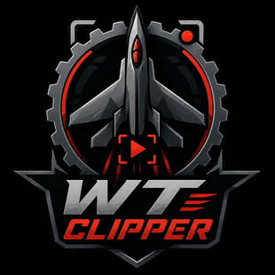
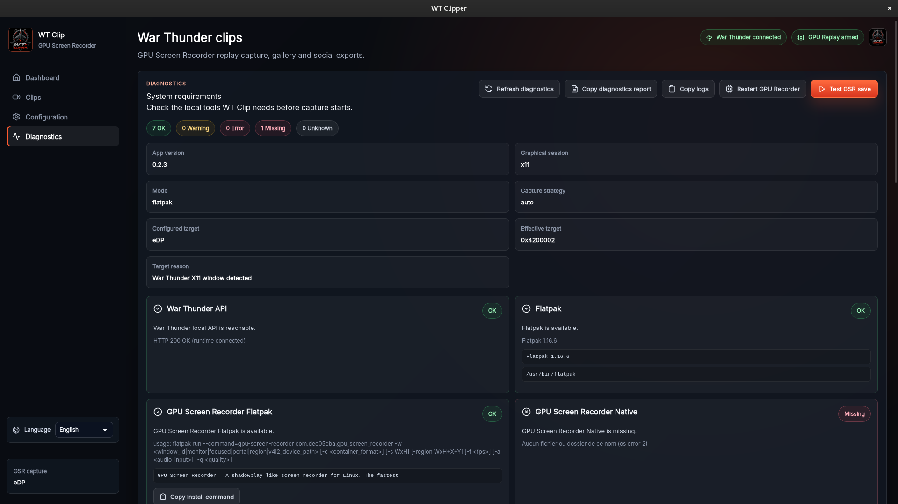
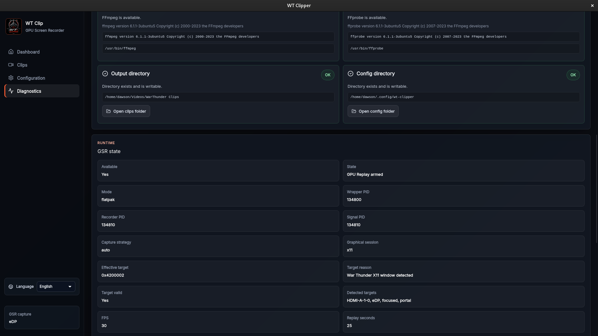
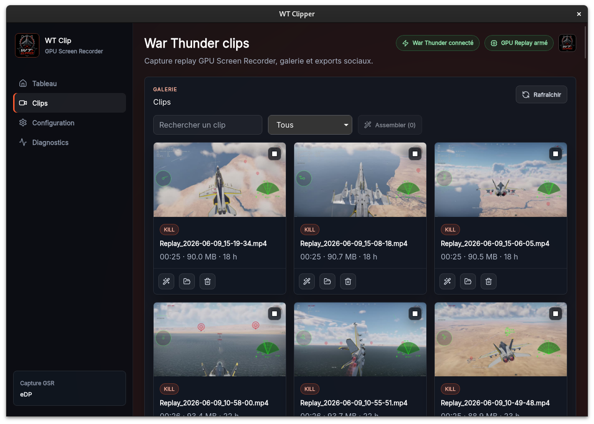
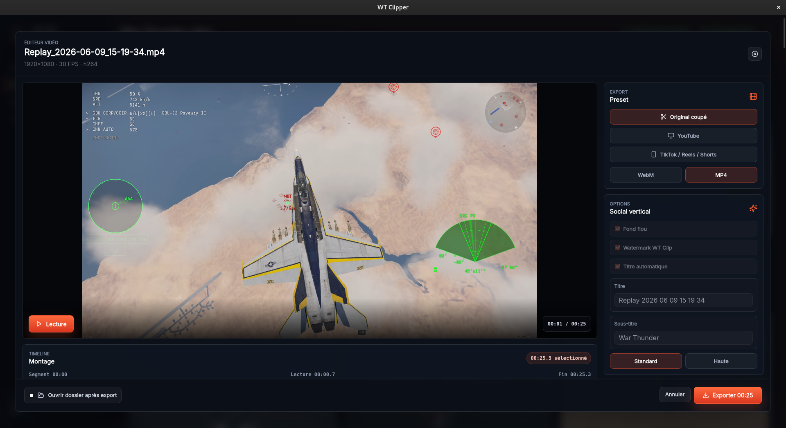
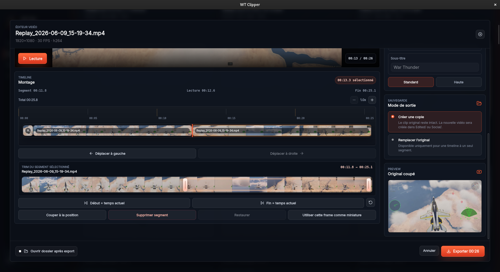
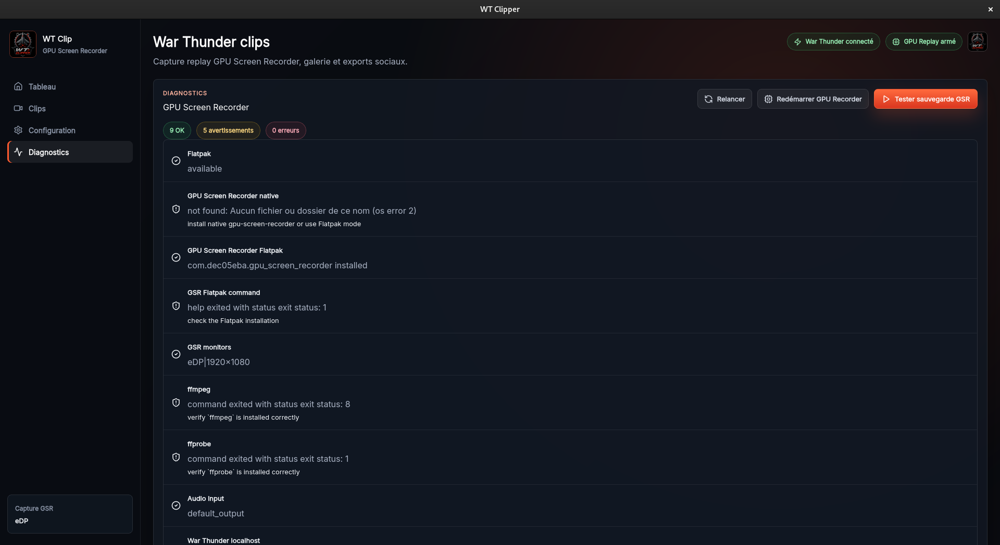

# WT Clipper

<p align="center">
  <!-- Image to add: put your final app logo here. Recommended path: docs/images/wt-clipper-logo.png -->
  
</p>

<p align="center">
  <strong>A Linux-native War Thunder clipper powered by Rust, Tauri, React and GPU Screen Recorder.</strong>
</p>

<p align="center">
  <a href="https://github.com/dawsoncarsoulle-lab/wt-clipper/releases/tag/v0.2.3"></a>
  <a href="LICENSE"></a>
  
  
</p>

---

## Overview

**WT Clipper** is a desktop clip recorder for **War Thunder on Linux**.

It keeps a replay buffer running with **GPU Screen Recorder**, watches War Thunder's local HTTP API, detects supported in-game events, and saves gameplay clips automatically.

The project aims to provide a Linux-first experience similar to Medal or ShadowPlay, but focused on War Thunder and built with native Linux capture backends in mind.

> WT Clipper is an independent project and is not affiliated with, endorsed by, or sponsored by Gaijin Entertainment or War Thunder.

---

### Dashboard

<!-- Image to add: main dashboard with WT Clipper waiting for War Thunder or armed with GSR.
Recommended screenshot:
- App opened on the Dashboard tab
- Status visible at the top
- Capture strategy visible
- War Thunder status visible
Recommended path: docs/images/dashboard.png -->

<p align="center">
  
</p>

<p align="center">
  
</p>

### Automatic capture on X11 / Wayland

### Clip gallery

<!-- Image to add: gallery grid with multiple generated clips and thumbnails.
Recommended screenshot:
- Several clips visible
- Duration visible
- Edited/Vertical badges visible if possible
Recommended path: docs/images/gallery.png -->

<p align="center">
  
</p>

### Video editor

<!-- Image to add: editor modal open on a clip.
Recommended screenshot:
- Video preview visible
- Timeline visible
- Trim handles / playhead visible
- Export options visible
Recommended path: docs/images/editor.png -->

<p align="center">
  
</p>

<p align="center">
  
</p>

### Diagnostics

<!-- Image to add: diagnostics tab with green checks.
Recommended screenshot:
- GPU Screen Recorder availability
- War Thunder API status
- Output directory check
- Runtime/capture information
Recommended path: docs/images/diagnostics.png -->

<p align="center">
  
</p>

---

## Features

### Automatic clips

- Watches War Thunder's local API at `http://127.0.0.1:8111`.
- Detects supported events from game chat and HUD messages.
- Saves clips automatically through GPU Screen Recorder's replay buffer.
- Supports post-event delay, so clips include the moment after the kill.
- Supports multi-kill grouping inside a configurable time window.

### Capture backend

- Uses **GPU Screen Recorder** as the capture engine.
- Supports Flatpak-based GPU Screen Recorder usage.
- Supports MP4 and MKV output containers.
- Supports H.264, HEVC and AV1 configuration depending on GPU Screen Recorder support.
- Supports GPU or CPU encoder selection.
- Supports CBR, VBR, QP and automatic bitrate modes.
- Supports CFR, VFR and content-based frame rate modes.

### Automatic capture strategy

WT Clipper can use an automatic capture strategy:

```toml
[capture]
capture_strategy = "auto"
```

In `auto` mode:

- WT Clipper waits until War Thunder is reachable through the local API.
- It does **not** ask for a capture target before the game is running.
- On X11, it can detect the War Thunder window natively.
- On Wayland, it uses the desktop capture selection flow when required.
- If a window target is not available, it can fall back to the configured monitor target.
- When War Thunder is closed and opened again, capture can be resolved again cleanly.

This makes the first-run experience much better on both X11 and Wayland.

### Gallery

- Scans the configured clip library.
- Shows generated clips with thumbnails, metadata and duration.
- Provides video preview through a local preview server.
- Supports deletion from the UI.
- Recognizes edited and vertical/social exports.

### Editor

WT Clipper includes a lightweight in-app video editor:

- Preview clips directly in the app.
- Trim start and end.
- Use a timeline with playhead and thumbnails.
- Split clips into segments.
- Delete or disable segments.
- Reorder segments before export.
- Export normal edited clips.
- Export vertical/social clips.
- Create a copy or replace the original with backup support.
- Generate thumbnails and metadata for edited exports.

### Diagnostics

WT Clipper includes diagnostics for development and troubleshooting:

- War Thunder local API reachability.
- GPU Screen Recorder availability.
- Runtime capture status.
- Capture target and target reason.
- Output directory and library paths.
- Recent capture errors.
- Replay save counters.
- Backend process information.

---

## Supported events

WT Clipper currently supports clipping for:

- Personal target destroyed events.
- Base destroyed events.
- Optional player destroyed / death events.

Configured in:

```toml
[triggers]
target_destroyed = true
base_destroyed = true
player_destroyed = false
```

---

## How it works

WT Clipper combines two systems:

### 1. War Thunder local API

War Thunder exposes match data locally on:

```text
http://127.0.0.1:8111
```

WT Clipper polls endpoints such as game chat and HUD messages, then parses new events to decide whether a clip should be saved.

### 2. GPU Screen Recorder replay buffer

GPU Screen Recorder runs a replay buffer in the background. When WT Clipper detects a relevant event, it sends a save request to GPU Screen Recorder and waits for the output file.

Simplified flow:

```text
War Thunder event -> WT Clipper parser -> replay save request -> GPU Screen Recorder -> clip file -> gallery
```

---

## Requirements

### Runtime requirements

- Linux.
- War Thunder.
- GPU Screen Recorder.
- Flatpak, if using the default Flatpak mode.
- FFmpeg, required by the editor and media analysis features.
- A desktop session supported by GPU Screen Recorder.

### Development requirements

- Rust and Cargo.
- Node.js and npm.
- Tauri v2 build dependencies.
- GPU Screen Recorder for capture testing.
- FFmpeg for editor testing.

---

## Installing GPU Screen Recorder

WT Clipper is designed to work with GPU Screen Recorder installed from Flathub:

```bash
flatpak install flathub com.dec05eba.gpu_screen_recorder
```

Verify installation:

```bash
flatpak run --command=gpu-screen-recorder com.dec05eba.gpu_screen_recorder --help
```

You can also list available audio devices:

```bash
flatpak run --command=gpu-screen-recorder com.dec05eba.gpu_screen_recorder --list-audio-devices
```

And available monitors / capture targets:

```bash
flatpak run --command=gpu-screen-recorder com.dec05eba.gpu_screen_recorder --list-monitors
```

---

## Installing FFmpeg

The editor uses FFmpeg for trimming, encoding, metadata extraction and thumbnail generation.

On Ubuntu / Pop!\_OS / Debian-based systems:

```bash
sudo apt install ffmpeg
```

Verify:

```bash
ffmpeg -version
ffprobe -version
```

---

## Installing WT Clipper

Download the latest `.deb` package from the GitHub Releases page, then install it:

```bash
sudo apt install ./wt-clipper*.deb
```

If your system requires a manual dependency fix:

```bash
sudo dpkg -i ./wt-clipper*.deb
sudo apt install -f
```

---

## Running from source

Clone the repository:

```bash
git clone https://github.com/dawsoncarsoulle-lab/wt-clipper.git
cd wt-clipper
```

Install JavaScript dependencies:

```bash
npm install
npm --prefix frontend install
```

Run the desktop app in development mode:

```bash
npm run dev
```

Or run through the Rust CLI entrypoint:

```bash
cargo run --release -- gui
```

---

## Building

Build frontend only:

```bash
npm run frontend:build
```

Build the full Tauri app:

```bash
npm run build
```

Equivalent command:

```bash
cargo tauri build
```

Generated desktop packages are placed under the Tauri build output directory, usually:

```text
src-tauri/target/release/bundle/
```

The project is configured to build Linux bundles such as `.deb` and `.rpm`.

---

## Configuration

The default configuration path is:

```text
~/.config/wt-clipper/config.toml
```

Create a default config:

```bash
cargo run --release -- config init
```

Overwrite an existing config:

```bash
cargo run --release -- config init --force
```

Example configuration:

```toml
[clip]
post_event_seconds = 5
multi_kill_window_seconds = 8

[library]
output_dir = "/home/user/Videos/WarThunder Clips"

[capture]
capture_strategy = "auto"
target = "eDP"
mode = "flatpak"
fps = 30
replay_seconds = 25
container = "mp4"
codec = "h264"
encoder = "gpu"
quality = "very_high"
bitrate_mode = "cbr"
frame_rate_mode = "cfr"
keyframe_interval_seconds = 1.0
restart_replay_on_save = false
video_bitrate_kbps = 30000
output_dir = "/home/user/Videos/WarThunder Clips/GSR"
audio_enabled = true
audio_input = "default_output"

[war_thunder]
base_url = "http://127.0.0.1:8111"
player_name = "your_player_name"
poll_interval_ms = 300
request_timeout_ms = 500

[triggers]
target_destroyed = true
base_destroyed = true
player_destroyed = false

[storage]
max_clips = 100
max_storage_gb = 20
```

### Important configuration fields

| Section       | Field                       | Description                                                      |
| ------------- | --------------------------- | ---------------------------------------------------------------- |
| `clip`        | `post_event_seconds`        | Delay after an event before saving the replay.                   |
| `clip`        | `multi_kill_window_seconds` | Time window used to group close kills.                           |
| `library`     | `output_dir`                | Main clip library directory.                                     |
| `capture`     | `capture_strategy`          | Capture target strategy: `auto`, `monitor`, `focused`, `portal`. |
| `capture`     | `target`                    | Fallback monitor or target name.                                 |
| `capture`     | `replay_seconds`            | Replay buffer length.                                            |
| `capture`     | `fps`                       | Capture frame rate.                                              |
| `capture`     | `video_bitrate_kbps`        | Bitrate used when `bitrate_mode = "cbr"`.                        |
| `war_thunder` | `player_name`               | Your War Thunder nickname, used for personal kill detection.     |
| `triggers`    | `target_destroyed`          | Enables kill clips.                                              |
| `triggers`    | `base_destroyed`            | Enables base destruction clips.                                  |
| `triggers`    | `player_destroyed`          | Enables death clips.                                             |

---

## Capture strategies

### `auto`

Recommended default.

```toml
capture_strategy = "auto"
```

WT Clipper waits for War Thunder, then picks the most suitable capture target for the current session.

### `monitor`

Forces the configured monitor target.

```toml
capture_strategy = "monitor"
target = "eDP"
```

Useful if automatic window capture is not desired.

### `focused`

Advanced fallback mode for capturing the focused window.

```toml
capture_strategy = "focused"
```

### `portal`

Uses desktop capture portal behavior.

```toml
capture_strategy = "portal"
```

Most useful on Wayland. WT Clipper waits for War Thunder before triggering the selection flow.

---

## Recommended capture settings

Good default for quality and stability:

```toml
[capture]
capture_strategy = "auto"
fps = 30
replay_seconds = 25
container = "mp4"
codec = "h264"
encoder = "gpu"
quality = "very_high"
bitrate_mode = "cbr"
video_bitrate_kbps = 30000
frame_rate_mode = "cfr"
keyframe_interval_seconds = 1.0
restart_replay_on_save = false
```

For smaller files, reduce bitrate:

```toml
video_bitrate_kbps = 15000
```

For smoother clips, increase FPS if your system handles it:

```toml
fps = 60
```

---

## CLI commands

WT Clipper includes CLI commands for development and diagnostics.

Run the desktop UI:

```bash
cargo run --release -- gui
```

Create config:

```bash
cargo run --release -- config init
```

Run diagnostics:

```bash
cargo run --release -- doctor
```

Run diagnostics as JSON:

```bash
cargo run --release -- doctor --json
```

Check War Thunder local API:

```bash
cargo run --release -- status
```

Dump War Thunder game chat endpoint:

```bash
cargo run --release -- dump gamechat
```

Dump War Thunder HUD messages:

```bash
cargo run --release -- dump hudmsg
```

Watch War Thunder events from the terminal:

```bash
cargo run --release -- watch
```

Run automatic clipping without the full UI:

```bash
cargo run --release -- auto
```

Include existing events at startup:

```bash
cargo run --release -- auto --include-history
```

---

## Development workflow

Run Rust checks:

```bash
cargo check
```

Run Rust tests:

```bash
cargo test
```

Run frontend build:

```bash
npm --prefix frontend run build
```

Run frontend tests:

```bash
npm --prefix frontend test
```

Recommended pre-commit validation:

```bash
cargo check && \
cargo test && \
npm --prefix frontend run build
```

---

## Release workflow

Before publishing a release, read:

```text
RELEASE_CHECKLIST.md
```

Typical flow:

```bash
git checkout main
git pull
cargo check
cargo test
npm --prefix frontend run build
cargo tauri build
```

Then create a tag:

```bash
git tag vX.Y.Z
git push origin main
git push origin vX.Y.Z
```

Upload generated artifacts from:

```text
src-tauri/target/release/bundle/
```

The Tauri updater is configured to use GitHub Releases and a `latest.json` endpoint.

---

## Troubleshooting

### WT Clipper says “Waiting for War Thunder”

This is normal if War Thunder is not running.

Verify the local API:

```bash
curl http://127.0.0.1:8111/state
```

If it does not respond, start War Thunder and enter a state where the local API is available.

### GPU Screen Recorder is not detected

Check installation:

```bash
flatpak run --command=gpu-screen-recorder com.dec05eba.gpu_screen_recorder --help
```

Check running processes:

```bash
pgrep -af "gpu-screen-recorder|bwrap|flatpak"
```

A real recording process usually contains `gpu-screen-recorder` with capture arguments. The GTK UI and game tracker alone are not enough.

### No clip is created after a kill

Check:

- War Thunder is detected by WT Clipper.
- GPU Screen Recorder is armed.
- `war_thunder.player_name` matches your in-game nickname.
- `triggers.target_destroyed` is enabled.
- The output directory exists and is writable.
- The replay buffer has had enough time to fill.

### Wayland asks for a window

This can be expected. On Wayland, desktop security requires user-approved capture selection. WT Clipper tries to trigger that selection only after War Thunder is detected.

### X11 window detection does not pick War Thunder

Try setting `capture_strategy = "monitor"` temporarily, or use Diagnostics to inspect capture state.

Also verify War Thunder is actually running and visible.

### Clips have no audio

List audio devices:

```bash
flatpak run --command=gpu-screen-recorder com.dec05eba.gpu_screen_recorder --list-audio-devices
```

Check your config:

```toml
audio_enabled = true
audio_input = "default_output"
```

### Editor export fails

Install FFmpeg:

```bash
sudo apt install ffmpeg
```

Check:

```bash
ffmpeg -version
ffprobe -version
```

---

## Project structure

```text
.
├── frontend/                 # React + TypeScript UI
│   └── src/
│       ├── App.tsx           # Main application UI
│       ├── components/       # Editor, timeline, modals
│       ├── styles.css        # Main styling
│       └── types.ts          # Frontend DTOs
├── src/                      # Core Rust library and CLI
│   ├── app/                  # Auto clipping runtime
│   ├── capture/              # GPU Screen Recorder integration
│   ├── warthunder/           # War Thunder API client and parser
│   ├── config.rs             # App configuration
│   ├── doctor.rs             # Diagnostics
│   └── main.rs               # CLI entrypoint
├── src-tauri/                # Tauri desktop application
│   └── src/
│       ├── main.rs           # Tauri commands and app runtime
│       ├── editor.rs         # FFmpeg editor backend
│       └── updater.rs        # Updater integration
├── scripts/                  # Release and validation scripts
├── RELEASE_CHECKLIST.md
└── README.md
```

---

## Internationalization

The project should support internationalization in the future.

Current status:

- The README is written in English for wider discoverability.
- Some UI text and internal messages may still be mixed between English and French.
- A proper i18n layer is not fully implemented yet.

Recommended future i18n plan:

```text
frontend/src/i18n/
├── index.ts
├── en.json
└── fr.json
```

Recommended first supported languages:

- English
- French

Good first i18n targets:

- Navigation labels.
- Capture status labels.
- Diagnostics labels.
- Editor buttons.
- Error messages.
- Release-facing UI text.

---

## Roadmap

Planned or considered improvements:

- Better first-run onboarding.
- More complete diagnostics and “copy logs” support.
- Cleaner i18n support.
- Better capture troubleshooting UI.
- More editor polish.
- Multi-clip assembly improvements.
- Cloud sharing later.
- Public clip pages later.
- More games support later.

---

## Contributing

Useful test matrix:

- X11 session.
- Wayland session.
- Steam War Thunder.
- Standalone War Thunder launcher.
- Internal laptop monitor.
- External monitor.
- Desktop audio.
- Microphone audio.
- MP4 output.
- Editor export.
- `.deb` installation.

Before submitting changes:

```bash
cargo fmt
cargo check
cargo test
npm --prefix frontend run build
```

---

## License

WT Clipper is licensed under the MIT License.

See [LICENSE](LICENSE).

---

## Disclaimer

WT Clipper is an independent community project.

It is not affiliated with, endorsed by, or sponsored by Gaijin Entertainment or War Thunder.

War Thunder is a trademark of its respective owner.
